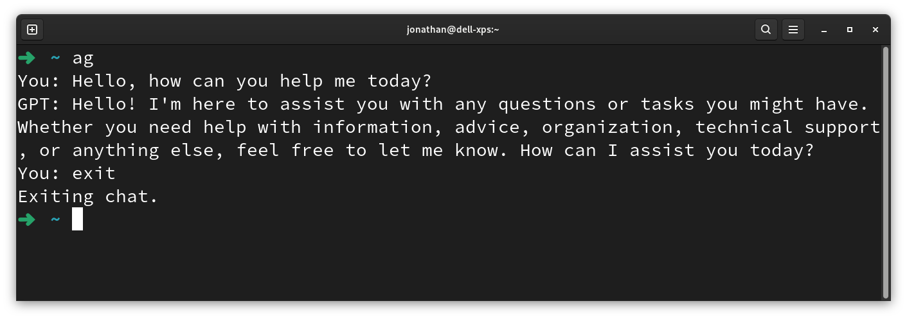

# Azure OpenAI Agent CLI

This project provides a simple command-line interface (CLI) to interact with the Azure OpenAI service using Python. By typing `ag` in the terminal, users can start a chat session with the GPT model deployed on Azure.

## Table of Contents

- [Prerequisites](#prerequisites)
- [Installation](#installation)
- [Usage](#usage)
- [Configuration](#configuration)
- [Contributing](#contributing)
- [License](#license)

## Prerequisites

- Python 3.x
- Virtual environment tool (such as `venv`)
- Azure OpenAI API key and deployment name

## Installation

1. Clone the repository:

   ```bash
   git clone git@github.com:jonlai211/Azure-OpenAI-Agent-CLI.git
   cd Azure-OpenAI-Agent-CLI/
   ```

2. Create and activate a virtual environment:

   ```bash
   python3 -m venv .venv
   source .venv/bin/activate
   ```

3. Install the required packages:

    ```bash
   pip install requests
   ```

4. Modify the `ag` Bash script:

   ```bash
   echo '#!/bin/bash
   source "Your_Path/Azure OpenAI Agent/.venv/bin/activate"
   python "Your_Path/Azure OpenAI Agent/agent.py"' > ag.bash
   chmod +x ag.bash
   sudo cp ag.bash /usr/local/bin/ag
   ```

## Usage

To start a chat session with the GPT model, simply type `ag` in your terminal and press Enter. Type your questions or commands, and the GPT model will respond. To exit the chat session, type `exit` or `quit`.



## Configuration

Before running the script, you need to configure your Azure OpenAI endpoint and API key in the `agent.py` file:

```python
endpoint = "https://YOUR_DEPLOYMENT_NAME.openai.azure.com/openai/deployments/YOUR_DEPLOYMENT_NAME/chat/completions?api-version=2024-02-15-preview"
api_key = "YOUR_API_KEY"
```

Replace `YOUR_DEPLOYMENT_NAME` and `YOUR_API_KEY` with your actual deployment name and API key from Azure.

## Contributing

Contributions are welcome! Please feel free to submit a Pull Request.

## License

This project is licensed under the MIT License.